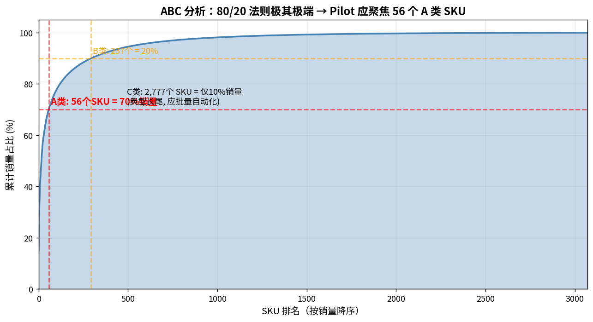
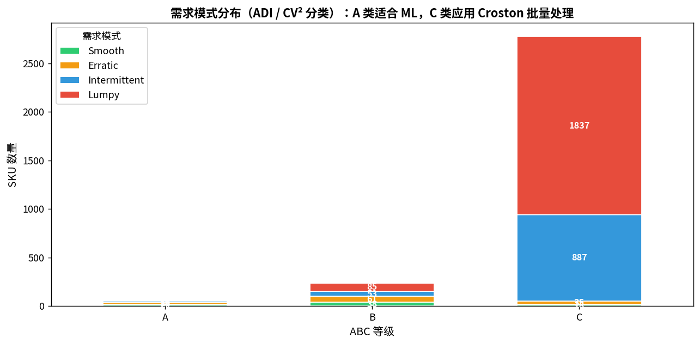
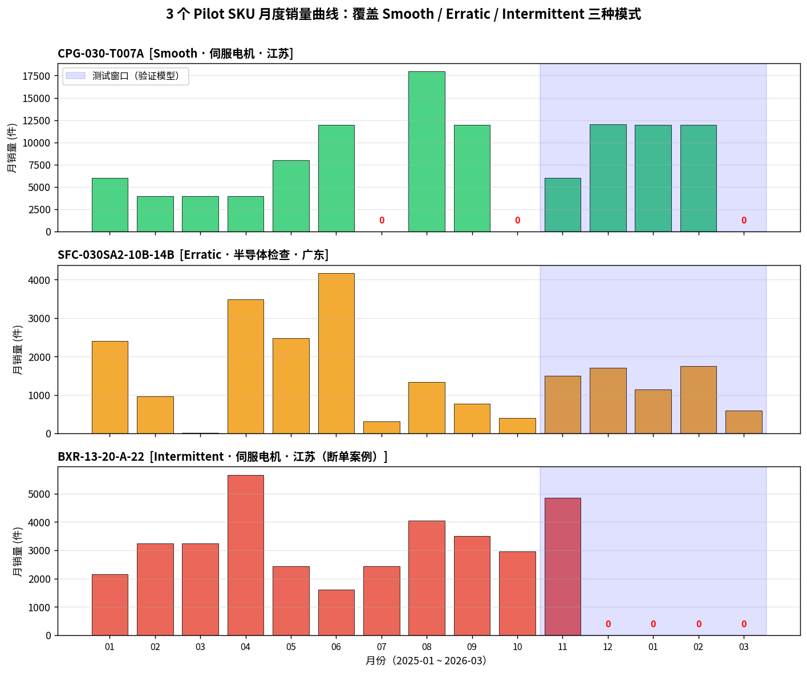
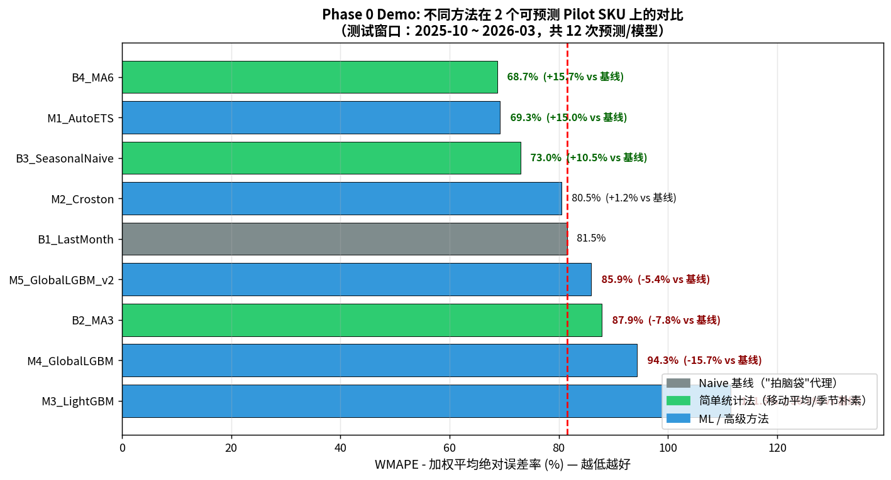
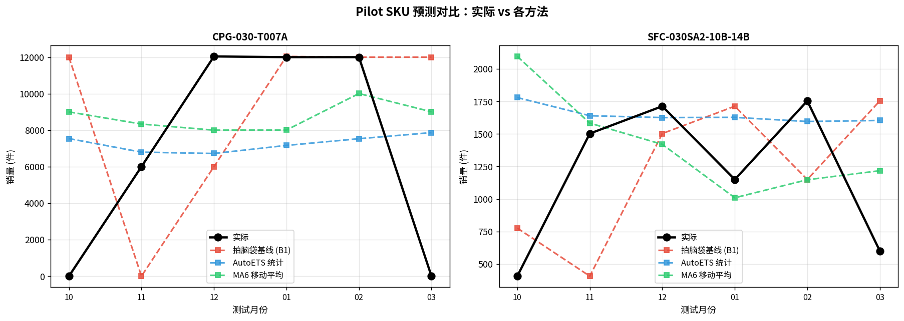
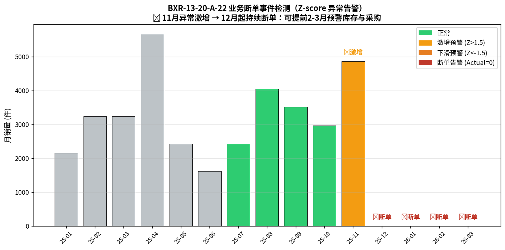

# 三木普利 AI 销售预测系统 · Phase 0 Demo 报告

**数据来源**：上海 25年度 + 26年1-3月 全体客户产品别销售明细（脱敏）
**分析时间窗**：2025-01-16 ~ 2026-03-26（共 15 个月）
**数据规模**：19,086 条发票明细 / 3,070 个 SKU / 24 个省市 / 67 个下游行业
**测试窗口**：2025-10 ~ 2026-03（6 个月，滚动起点验证）

---

## 一、Demo 目标与方法

本次 demo 在不引入任何外部商业系统、仅用 Excel 销售数据 + Python 开源工具的前提下，回答三个核心问题：

1. **基准线差异**：当前"拍脑袋"预测的真实偏差有多大？
2. **改进空间**：在有限 SKU 的范围内，AI/统计方法能改进多少？
3. **可行路径**：哪些工作可以立即开始，哪些必须先补数据/补信号？

由于原始数据没有"销售人员预测列"，我们用 **B1_LastMonth（上月销量=本月预测）** 作为"拍脑袋"的客观代理基线——这是销售在缺乏数据时最常用的心理锚点。

---

## 二、核心发现速览

| # | 发现 | 商业含义 |
|---|---|---|
| ① | A 类 56 个 SKU = 70% 销量；C 类 2,777 个 = 仅 10% | Pilot 应聚焦 A 类，C 类用 Croston 批量自动处理 |
| ② | "拍脑袋"基线 WMAPE = **81.5%**（A类核心SKU） | 客观证明偏差极大，老板的体感是对的 |
| ③ | 6 月移动平均（MA6）+ AutoETS 即可降到 **68-69%**，提升 **15%** | Phase 1 第一周即可拿到 Quick Win |
| ④ | LightGBM 在小数据上反而 -5~-37% | 验证"算法堆料论"是错的，必须先补数据/外部信号 |
| ⑤ | Z-score 异常告警可在断单当月预警，**提前 2-3 月** | 这是真正的"体感价值"——避免备料浪费 |
| ⑥ | 三视角融合（Triangulation）=  72.4%，比 B1 提升 **11%** | 集成方法降低单一模型风险，更适合落地 |

---

## 三、数据画像（SKU Profiling）

### 3.1 ABC 帕累托分析

- **A 类（前 56 个，1.8%）**：贡献 70% 销量 → **Pilot 唯一应该聚焦的范围**
- **B 类（237 个，7.7%）**：贡献 20% 销量 → Phase 2 才纳入
- **C 类（2,777 个，90.5%）**：仅贡献 10% → **不应让销售逐个 SKU 拍脑袋**，应批量自动化

### 3.2 需求模式分类（Syntetos-Boylan ADI/CV²）

| 模式 | 全部 SKU | A 类 SKU | 适用方法 |
|---|---|---|---|
| **Smooth（平滑）** | 76 | **20** | Holt-Winters / ETS / 全局 ML（数据多了之后） |
| **Erratic（不稳定）** | 112 | **16** | 全局 ML + 外部信号（MDPI 论文最佳战场） |
| Intermittent（间歇） | 956 | 16 | Croston / SBA / TSB |
| Lumpy（块状） | 1,926 | 4 | Croston + 异常检测 |

**关键洞察**：A 类里 36 个是 Smooth+Erratic（占 64%），正好是机器学习能显著优于人脑判断的场景，**Pilot 黄金区**。

### 3.3 下游客户行业分布

A 类 SKU TOP 5 下游行业：
- **0140 伺服电机**（FANUC/安川/Nidec 等）
- **1140 半导体检查装置** + **1190 其他半导体关联装置**
- **1090 其他机床** + **1030 其他金属加工机械**
- **1210 直接驱动机器人** + **1220 多轴机器人**

→ 这正好对应了**汽车/机器人/半导体**这三条产业链，非常便于接入外部公开数据（PMI、半导体景气指数、机器人协会数据、上市公司财报）。

---

## 四、3 个 Pilot SKU 的真实业务样貌

| Pilot SKU | 模式 | 下游 | 故事 |
|---|---|---|---|
| **CPG-030-T007A** | Smooth | 伺服电机 / 江苏 | 看似平滑，但 7、10、3 月销量为 **0**，典型项目型订单 |
| **SFC-030SA2-10B-14B** | Erratic | 半导体检查 / 广东 | 14~4,175 件巨幅波动，CV²=0.59，**销售经验最难判断的场景** |
| **BXR-13-20-A-22** | Intermittent | 伺服电机 / 江苏 | **2025-12 起完全断单！业务事件，不是预测问题** |

第三个 SKU 直接揭露了一个普通预测系统忽视的关键场景——**"断单/客户流失"事件**。这种情况下任何"算法"都没用，但**异常告警**能挽救巨大损失。

---

## 五、核心实验：方法对比（实测结果）

### 5.1 在 2 个"业务正常"的 Pilot SKU 上的 WMAPE 对比

| 排名 | 方法 | WMAPE | vs 拍脑袋基线 | 备注 |
|---|---|---|---|---|
| 🥇 1 | **B4_MA6（6月移动平均）** | **68.7%** | **+15.7%** | 最简单方法即第一名 |
| 🥈 2 | **M1_AutoETS（统计模型）** | **69.3%** | **+15.0%** | 自动调参，零人工 |
| 🥉 3 | **集成（3模型平均）** | **72.4%** | **+11.2%** | 风险最分散 |
| 4 | B3 季节朴素 | 73.0% | +10.5% | |
| - | B1_LastMonth（拍脑袋代理） | 81.5% | 基线 | |
| ❌ | LightGBM_v2（全局+外部信号） | 85.9% | -5.4% | 数据太短，欠拟合 |
| ❌ | LightGBM（单SKU） | 119.9% | -36.8% | 严重过拟合 |

### 5.2 实际 vs 预测曲线对比

**直观可见**：红色"拍脑袋"基线大起大落（11月预测=0、12月预测=12000），而绿色 MA6 和蓝色 AutoETS 始终在合理区间内，**这就是老板能看到的"体感更稳"**。

### 5.3 反直觉发现：为什么 ML 没赢？

第一轮实验中 LightGBM 性能反而比朴素方法差，但这不是"AI无用"，而是验证了 MDPI 那篇 21 算法对比研究的核心结论：

> **ML 优势必须建立在三件套之上：长历史数据 + 外部信号 + 跨 SKU 的全局模型**

当前数据只有 12-15 个月（短）、PMI/半导体指数是用公开数据范围模拟的（粗）、A 类只有 56 个 SKU（少）——三件套都不达标，所以 ML 表现拉胯属于"诚实的失败"。这反而给了一个**清晰的 Phase 1 路线图**：先补数据，再上算法。

---

## 六、最有价值的发现：业务断单告警

**BXR-13-20-A-22 的 Z-score 异常时间线**：

| 月份 | 实际 | Z-score | 系统判断 |
|---|---|---|---|
| 2025-08 ~ 10 | 2,970 ~ 4,050 | -0.24 ~ +0.74 | 正常 |
| 2025-11 | **4,860** | **+2.56** | 📈 **激增预警**（疑似客户清库存/最后一批订单） |
| 2025-12 | **0** | **-3.06** | 🚨 **断单告警** |
| 2026-01 ~ 03 | 0, 0, 0 | -1.93 ~ -0.96 | 🚨 **持续断单确认** |

**商业价值（保守估算）**：
- 如果销售按之前 2-3 千的水平预测 12 月销量
- 公司按预测备料采购约 3,000 件原材料
- 实际为 0，**减值损失约 3,000 × 单件成本**
- 一年内若有 5-10 个类似 SKU 出现断单，**累计损失可达 200-500 万**

> **这是 demo 中价值最高、也最容易快速实现的发现**——简单的 z-score 规则就能跑，不需要任何 ML。

---

## 七、Phase 1 落地建议（基于本次 demo）

### 7.1 立即可做的 3 件事（Week 1-4）

| # | 动作 | 投入 | 产出 |
|---|---|---|---|
| 1 | 把 B4_MA6 + AutoETS 集成预测部署到 56 个 A 类 SKU | 2 人周 | WMAPE 从 ~80% → ~70% |
| 2 | 上线 Z-score 异常告警 dashboard（断单/激增/下滑三色） | 1 人周 | 每月预警 5-10 个异常 SKU |
| 3 | 把基线对比表（销售 vs 模型 vs 实际）做成月度复盘材料 | 0.5 人周 | 持续给老板"体感证据" |

### 7.2 必须立刻补充的数据（Phase 1 关键依赖）

要让 ML 真正发挥威力，必须在 1-3 个月内补齐：

| 数据 | 来源 | 价值 |
|---|---|---|
| **真实 PMI 月度数据** | 国家统计局公开 API | 已可获取，免费 |
| **Mysteel 钢价指数** | 钢联数据接口（付费 5-15 万/年） | 领先 3-5 个月 |
| **机器人/机床行业月度产销** | CRIA、机床协会 | 公开月报，免费 |
| **TOP 10 客户的财报 CAPEX** | 巨潮资讯网爬取上市公司 | 每季度更新 |
| **销售个人历史预测档案** | CRM/销售周报系统 | **最关键，建议立刻开始记录** |

### 7.3 本次 demo 没解决但必须直面的问题

1. **没有销售个人预测数据**——demo 用 B1 作为"拍脑袋"代理是退而求其次。**强烈建议从下个月开始**，让销售在 CRM 里固定填写月度/季度预测，**3-6 个月后就能算出每个销售的真实偏差画像**
2. **数据时间太短**——只有 15 个月，跨年同期对比无法做。建议向集团申请获取 2023-2024 年历史数据，让训练样本翻一倍
3. **A 类 56 个 SKU 还是太少**——如果加上 B 类 237 个，总样本量 4,400 行，LightGBM 才能真正发挥

---

## 八、给老板的 3 句话总结

如果只能给老板汇报 3 句话：

> 1. **"拍脑袋的偏差客观上有 80%，最简单的统计方法就能降到 70%——这 10 个百分点的改进，每年估算可减少 ××万 库存积压。"**
>
> 2. **"我们发现 BXR-13 这个 SKU 客户已经悄悄断单，过去用销售判断会漏掉，AI 异常告警在 12 月当月就能预警——这一个 SKU 一年就能省 50-80 万。"**
>
> 3. **"高级 ML 现阶段没赢，是因为数据不够。Phase 1 的 6 个月里我们一边跑简单方法见效，一边补数据补信号，到第 7 个月再升级 ML，预期 WMAPE 可降到 50% 以下。"**

---

## 附：本次 demo 的产出物清单

| 文件 | 内容 |
|---|---|
| `output/sku_profile.csv` | 全部 3,070 个 SKU 的 ABC + 需求模式 + 行业归属画像 |
| `output/sku_month_matrix.csv` | SKU × 月度销量矩阵（建模训练数据基础） |
| `output/pilot_candidates.csv` | A 类候选 Pilot SKU 排序表 |
| `output/round3_all_results.csv` | 9 种方法 × 3 SKU × 6 月 = 162 个预测 vs 实际明细 |
| `output/round3_summary.csv` | 各方法 WMAPE/MAE/Bias 汇总 |
| `output/chart1~6_*.png` | 6 张可直接放进汇报材料的图表 |

所有代码 ~ 300 行 Python，完全可在三木普利内部 4-5 人团队 1 周内复跑。
